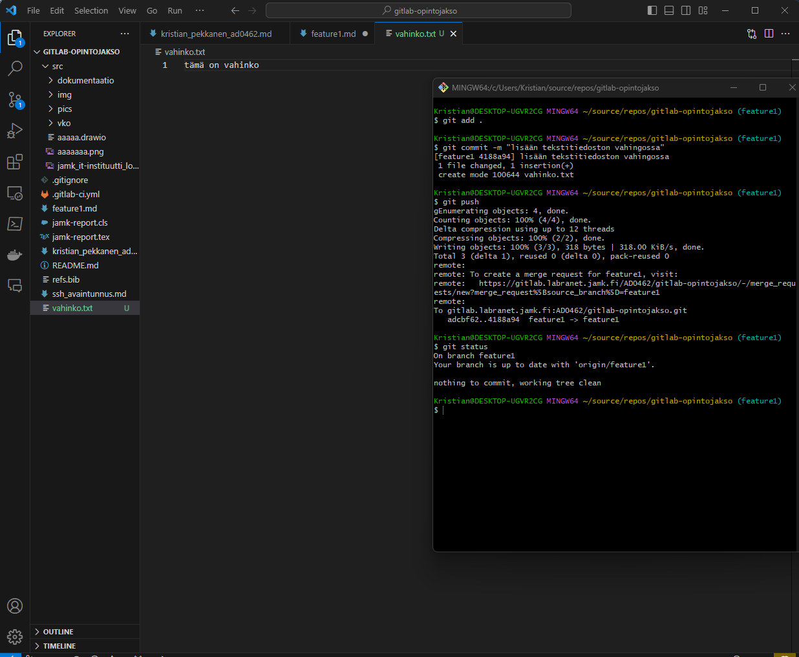

# git revert

Gitin "revert" -komentoa käytetään perua aikaisempi git-historiassa oleva commit. Tätä käytetään yleensä, kun haluat perua tietyn commitin tekemät muutokset ja luoda uuden commitin, joka kumoaa nämä muutokset. Git revert on hyödyllinen, kun et halua poistaa historian muutoksia, mutta haluat lisätä uuden muutoksen, joka kumoaa aiemman muutoksen.
 
Yleinen tilanne, jossa voit käyttää "git revert" -komentoa, on, kun huomaat, että tietyssä commitissa tehdyt muutokset aiheuttavat ongelmia, ja haluat palata takaisin aikaisempaan tilaan ilman, että poistat koko commitin historian.
 
esimerkki:

lisäsin vahingossa vahinko.txt tiedoston:

nyt revertaan commitin.
ensin etsitään git log-komennolla commit joka halutaan revertaa:

commit 4188a94e89d695c36e00df428e97bd60d060a601 on meidän vahinko commit.

ja suoritetaan seuraava komento:

>git revert 4188a94e89d695c36e00df428e97bd60d060a601

suoritus:
 

 
ja vahinko on poistettu.

