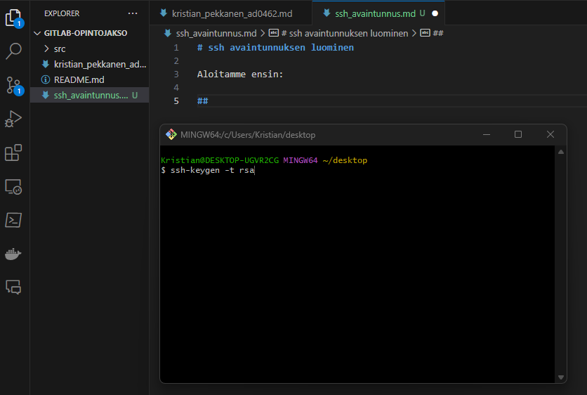
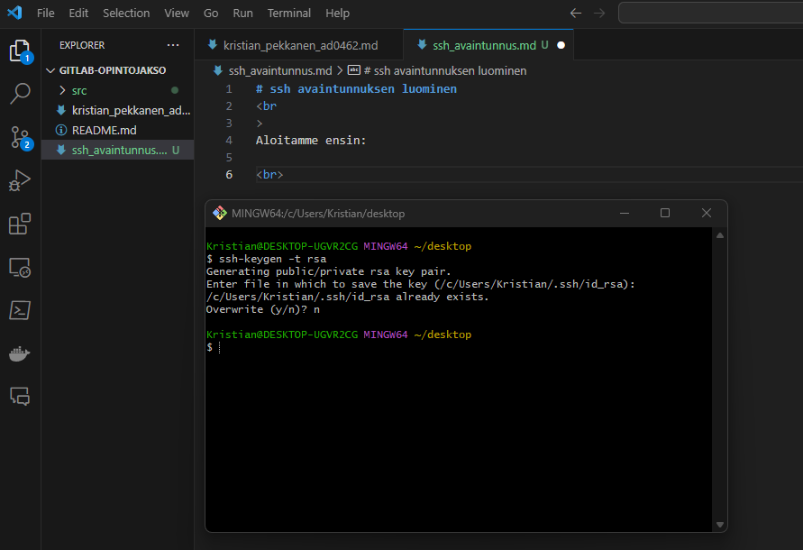
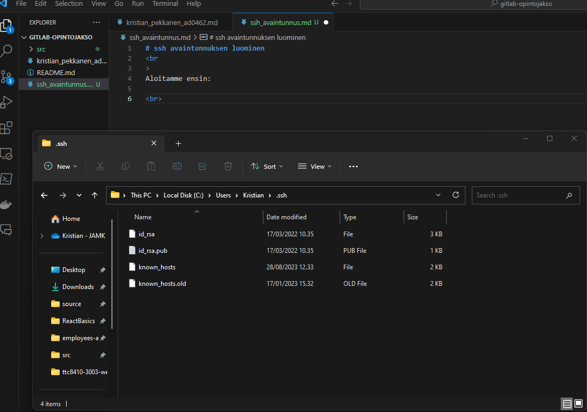
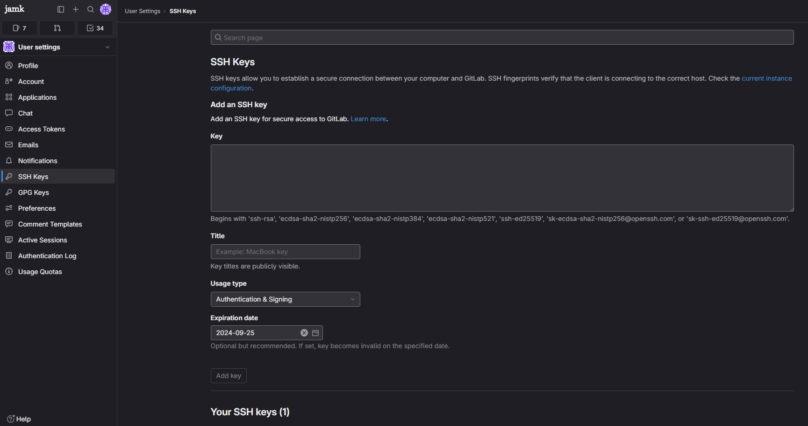
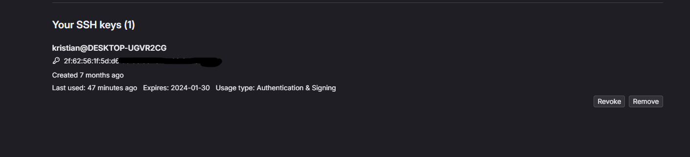

# ssh avaintunnuksen luominen
 
Aloitamme ensin komennolla:

> ssh-keygen -t rsa

 

Olen kumminkin jo aikaisemmin luonut ssh-avaimen, joten en luo uutta.
 

 

Tiedosto löytyy polusta:

>c:/users/%username%/.ssh

-kansiosta.

tiedostossa *id_rsa.pub* on juuri luomasi julkinen avain

# ssh avaimen vieminen gitlabiin:

 

 

Käyttäjän asetuksien alapuolella on "ssh avaimet", kun syötät tiedoston sisällön avain kohtaan ja painat "lisää avain, avain lisätään käyttäjällesi.
 
 
Kun avaimen lisääminen onnistuu, se näkyy näin:

