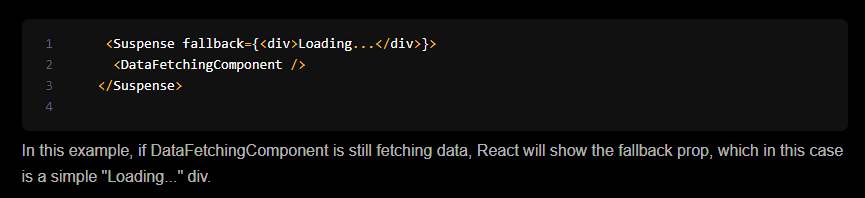
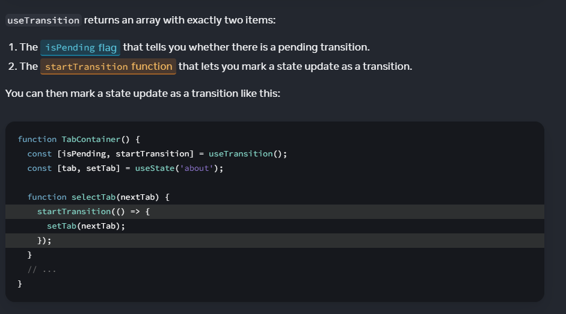
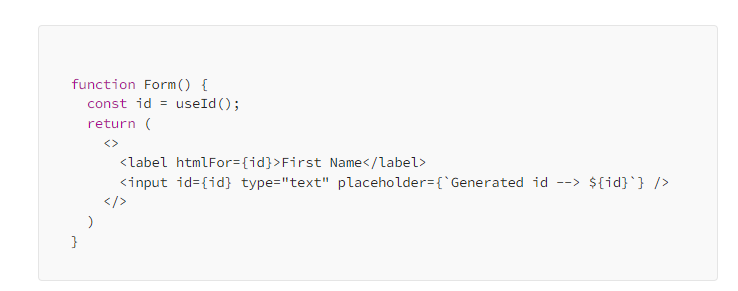
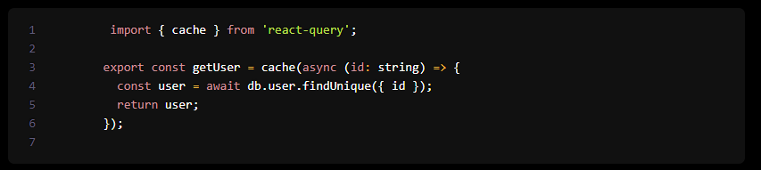

# How a new concurrency works and what is the main difference to old version of React rendering model?
 It introduces a new concurrent renderer that can work on multiple tasks at once, without blocking the main thread. 
 In concurrent mode, React prepares the new screen (or the updated state of a component) in memory before it updates the DOM. This is known as "rendering in memory" or "offscreen rendering"
 

# What is a < Suspence > component and give one example where it should be used?
< Suspense > lets you display a fallback until its children have finished loading.
It should be when: 
* Data Fetching
* Image Loading

 
Example:

 

# When you should use SSR and when not?
SSR should be used, when client has slow device, and you want to reduce how quickly user sees our content.
SSR should not be used, when your page needs to be refreshed often, or the webpage is very interactive or otherwise complex.

 

# What is a useTransition() hook and where it should be used?
useTransition() hook improves the application responsiveness by optimizing the performance. 
With this hook, you can specify any state updates as non-urgent. These non-urgent state updates will occur simultaneously with other urgent state updates, but the component rendering will not wait for the non-urgent state updates. 
 
It offers a couple of states _searchTerm_ and _filtered_. The _searchTerm_ is the state variable for managing the _filtered_ user list.  
The useTransition hook returns an array with two elements:

_isPending_: The first one is a boolean-type variable that returns true when the second element startTransition function executes. It returns false when the execution of the startsTranstion function is complete.

_startTransition_: A function that takes a callback function as an argument. This callback function should contain code related to the non-urgent state update. 
 

Example:

 

# What is a useIdhook and where it should be used?

useIdhook is a react 18 hook, that enables you to generate unique IDs for HTML form elements and ensure that the IDs are always unique in the context of the React application. The hook does not take any parameters.

Example usage:

 

 

# A few questions was presented. Did you find some other good new feature. Just name it in here and explain why feature is good one.
## Data fetching
 
React 18 introduces a new API for efficient data fetching and memoization of results. The cache function allows remembering the result of a function call.
 
Example:

 
Because React Server Components cannot access the Context API, these data fetching functionalities are extremely useful. The automated caching feature of cache and fetch enables exporting and reusing a single function from a global module across the application, assuring efficient data fetching and memoization.